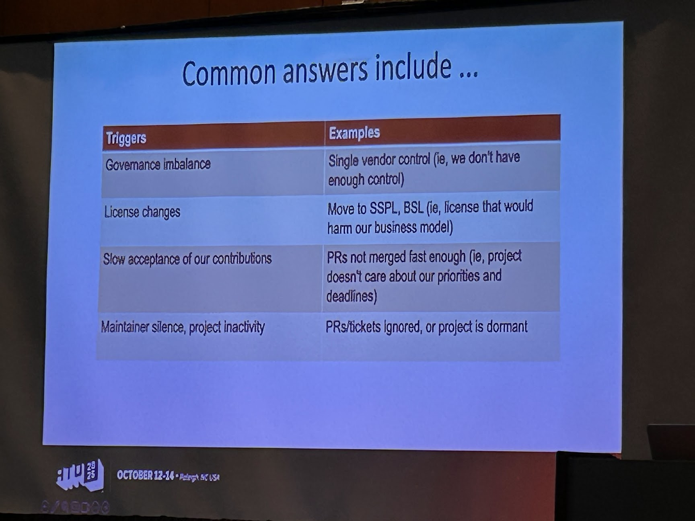

# All Things Open 2025

Overall I was less happy with the content, than in years past.  A significant majority of the sessions were "AI something, something".  I understand that it will be part of the conversation in many cases, but could we not feed the hype, rather focus on getting things done, and AI is a part of it?

I thought that the keynotes were too long, they were most of the morning on Monday, and again, long on Tuesday, leaving less time for the real reason to be there, sessions, there are a million 

## Sunday - Community Leadership Summit

### Keynote - Jono Bacon 

- Can the potential new contributer do something useful in just 10 minutes?  
If they can, they will feel that rush of achievement
- The community is across platforms and channels  
Some people are in a Facebook group/page, others Discord etc. You need to meet people where they are. For some, the barrier to entry is "I don't want yet another account, so I won't go to Discord"
- A shared docuement asking "What do you want to get out of this?"  
Options that folks can vote on to show you what the community wants/values. Think of the Unconference agenda building exercise.

### General notes, not necessarially by session

What additional incentives can we come up with for our user community?  Perhaps reminding folks about how we automated CTASK acceptance, how valuable that is to teams, and asking for ideas.

Focusing on the conversation more than the answer should help us understand the community better.

There's a company called Wagtail, a person from there led a session.

Incentives to be part of a community don't really exist in a corporate structure. If people participate, it's usually self motivation, or just saving time/frustration. 

Can we add recognition for participants into our Demo time?  I don't see a reason why not.


## Monday - Day one of the main event

#### 10 things I wish I knew about Linux when I first started - Jay Lacroix

- Distros change, have an A and a B distro, even if all you do is run the B option in a VM from time to time.  Know the fundamental differences, Is one Debian/Ubuntu based, and the other Red Hat based?  Apt vs DNF, etc.
- Fragmentation of Linux isn't a bad thing. That's one of the places were real innovation comes from. An existing distro has to bring folks along with incremental change, a new spin or distro can jump further.
- Use version control for configuation, this could be something that stashes your dotfiles in a repo, it could be an Ansible automation that applies a config, but is smart enough to understand the differences in the base of a distro
- You can't memorize all of the things, don't try.  Focus on how you find answers then learn the thing you are trying to do now. 
- Take notes, what did you do to create a configuration for a project?  Comments are necessary in code, but don't always tell you why you were trying to do that thing.
- Command history is your friend, issues usually recurr, so being able to search back in command history will help you with things like syntax and switches.  You can set command history to be longer than the default.
- 
        I inserted these two lines in my ~.bashrc

        HISTSIZE=2500
        export HISTSIZE

        Then "source ~.bashrc"


#### Beyond code, Soft skills for engineers 

- Among the most common failure points
  - Requirements missing/unclear/incomplete
  - Conflicting priorities
  - Surprise work
- Code Review comments
  - Be constructive and thourough
  - You may want to hae a call to conduct the review
  - Pressure reveals weak communication habits
  - Organize and divide the work of the code reviews, everyone does part and is engaged, and learns to do good reviews
  - Be calm, it spreads
  - **We need to return to the communication template, and have one for non-outage updates**
  - Document yoiur handover agreements
  - Silence is bad, if it's too quiet, either things aren't getting done, or maybe in a vacumn
- **We should do retros for more than just the sprint/PI reviews, but on significant work items** 
- Be aware of other people's communicaiton styles
- Those who embrace change have a higher chance of success. Things around us are changing, you can't avoid it, so embrace it

#### Linuix command line tips and tricks

- In .bashrc the variable HISTSIZE is useful, see above for more
- When cating logs, don't forget about the ^s and ^q for pause and resume, they date back to modem days.
- Another variable $OLDPWD can be useful, telling you the last directory you were in
```kevin@Fedora:~$ cd
kevin@Fedora:~$ cd /code
kevin@Fedora:/code$ cd
kevin@Fedora:~$ echo $OLDPWD
/code
```
- umask is worth us looking at to see if it would make sure that all files created on our shared storage would have the right owner

## Tuesday

### Connected Triangle Summit opening remarks. 

I got contact info for John Holden, his title is "Smart City Manager".  I intend to contact him to try to restart City Camp Raleigh. 

### Plan to fork, so you don't have to 

- Think of a fork like a DR plan, you don't want to do it, but if you have to, you want to be prepared
- Community engagement both make a fork less likely, but easier if you have to do it
- Things that trigger a fork
  


### Pull Requests that maintainers will love - Alya Abbott - Zulip

- What is a PR? - A presentation of your propsed changes
- What does the maintainer need to see?
  - What does this PR fix/change?
  - Does it align with project goals?
  - What is the risk of breaking something?
- Putting together a PR - What should be in a PR
  - Commit history
    - Tell the story, each commit should be a minimum viable idea
    - How each change is helpful/necessary
    - What is changed, not how you got here
  - Title and Description
    - Don't "not mention" the ugly things
    - Title is the overview
    - Details about how you decided to the specifics of the change
    - If you changed plans while doing this work
  - Before and after your proposed change
    - Show how you changed, before and after screenshots if visual elements are changed
  - Test info and links where practical (we need to work on test environment, email sent)
    - What did you test
    - How did you test it
    - Results, both narative and links
  - Self review information
    - What do you think about the change, and how effective it will be

#### Things to think about when creating a PR
- Are you solving what you set out to, or something else?
- Is the code "good", standardized etc.
- The commits, how good are the changes and the messages
- Review the title and description again
- Are screenshots updated and clear?

***We need a checklist or template for a PR, see if AZDO can do that***

[Zulip's contributing guide](https://zulip.readthedocs.io/en/latest/contributing/contributing.html)

I have sent a DM on LinkedIn for her slides as she suggested during the session.


### Non-Technial contributors find their place in Open Source communities

- Documentation - It would be a bit ironic if I did some of that, having started my career supporting Tech Writers at a VERY closed source company.
- Marketing - not me, most likely
- Pollicy and Strategy - This could be interesting for me
- Community Building - I would like to do this
  

  ### How to measure what really works in Open Source communities

- Understand your audience
- What content has been successful at getting engagement in the past
- Audience Engagement truisms
  - Contributoers decide how much attention to pay
  - Contributors use resources as tools
    - Give them the info that is relevant to the task
- Contributors actively interpret info through their own stack.  Especially when there are gaps in info.
