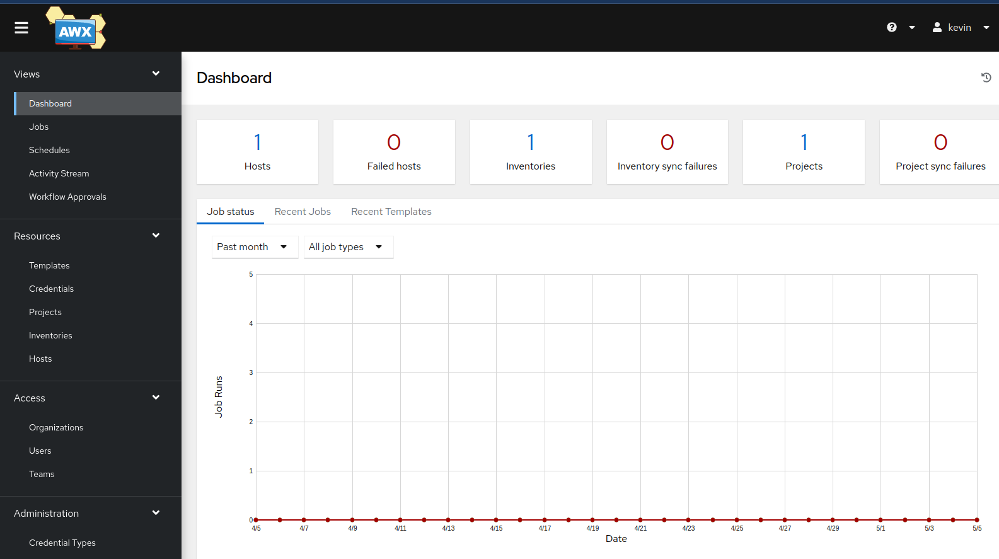

# AWX the web front end for Ansible

Yesterday I went to the local Redhat users group where Ansible was the topic. That finally got me to take a few minutes and figure out how to get AWX installed.  A while ago I set up the ansible server, but never got the web interface in place.

It turned out to be fairly easy to install on Fedora server. I got it going in under 30 minutes.

- Install Docker
- Install some python modules
- Clone the repo
- Run the Ansible build

[Install Ansible on Fedora](https://medium.com/@jegan_50867/installing-ansible-tower-awx-e46d5231357d)

[Install Docker CE on Fedora](https://docs.portainer.io/start/install-ce/server/docker/linux)

[official github project for AWX](https://github.com/ansible/awx)

[Docker-compose install doc](https://github.com/ansible/awx/blob/devel/tools/docker-compose/README.md)

You may ask why I did this, of course you will.  
I did it because it's the best representation that I can do at home, for free, of the Ansible Tower that is used in corporate environments (My job....)

## update:  I must have blown that VM away, or the installation.

I installed the current version of AWX in a Fedora workstation VM.  

It turned out to be harder to do a second time than the first.  

I did the setup, but got this instead of a login screen

    <% if (process.env.NODE_ENV === 'production') { %> <% } %> <% if
    (process.env.NODE_ENV === 'production') { %> <% } else { %> <% } %>
    <% if (process.env.NODE_ENV === 'production') { %>

To fix that, in another terminal, while the containers are running, make the UI clean

    docker exec tools_awx_1 make clean-ui ui-devel

I didn't find the default credentials, so I had to go in the container and set them.

    docker exec -u0 -it tools_awx_1 bash 

    awx-manage changepassword admin 

Now I'm logged in again and will work on a config that can be used to do more with other VMs