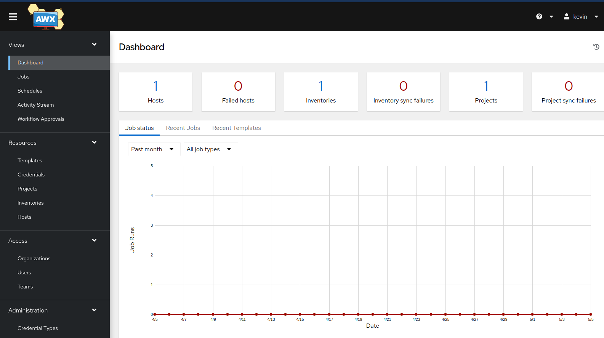

# AWX the web front end for Ansible

Yesterday I went to the local Redhat users group where Ansible was the topic. That finally got me to take a few minutes and figure out how to get AWX installed.  A while ago I set up the ansible server, but never got the web interface in place.

It turned out to be fairly easy to install on Fedora server. I got it going in under 30 minutes.

- Install Docker
- Install some python modules
- Clone the repo
- Run the Ansible build

[Install Ansible on Fedora](https://medium.com/@jegan_50867/installing-ansible-tower-awx-e46d5231357d)

[Install Docker CE on Fedora](https://docs.portainer.io/start/install-ce/server/docker/linux)

You may ask why I did this, of course you will.  
I did it because it's the best representation that I can do at home, for free, of the Ansible Tower that is used in corporate environments (My job....)