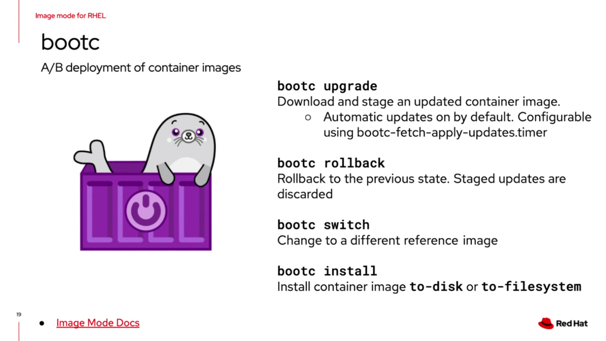
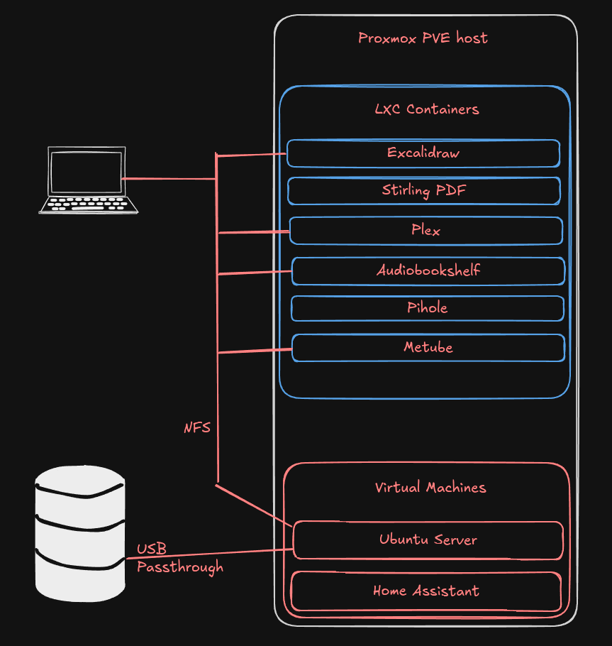

# Building a homelab

In a homelab you can have a starter place where you can learn some things, and if you re-purpose it later, it makes a good media center or home automaiton computer, or even a light web surfing machine mabe for the kids in the family room

## Hardware
A PC with enough storage for everything you want, VMs, data, containers.  That's not really that much storage space needed for most of us.

### The least expensive [$139](https://www.amazon.com/dp/B0F13Q2SLL?th=1)
I would expect to run one VM, and a couple of containers at once. 
- N150 
- 16GB RAM  
- 256GB onboard storage 


### Mid-range cost [$327](https://www.amazon.com/GMKtec-ryzen-mini-pc-computers/dp/B0CD7Y4C5Y?th=1)
You can easily run multiple VMs and several containers at once.
- Ryzen 7
- 32GB RAM
- 1TB onboard storage
- Room for another SSD to add 1 or even 2 TB more storage


### Platform
[Proxmox Virtual Environment](https://www.proxmox.com/en/products/proxmox-virtual-environment/overview) ,a free hypervisor and containers platform. There is good documentation, that will help you with the installation. 

There is a rich community, someone started creating [Helper Scripts](https://community-scripts.github.io/ProxmoxVE/scripts) These will make it really easy to install many different VMs or containers.

### Guests
- Full VM development environment
  - Fedora Linux
  
  You get a full GUI and the ability to install all kinds of development tools, for free.

- Containers that you might find interesting
  - [Plex](https://www.plex.tv/), A media server, not fully free or open source, but has features like remote access
  - [Jellyfin](https://community-scripts.github.io/ProxmoxVE/scripts?id=jellyfin) is a different media server, but remove access is not so simple, see notes below about tailscale
  - [Piehole](https://community-scripts.github.io/ProxmoxVE/scripts?id=pihole) a network level (whole home) ad blocker
  - [MySQL](https://community-scripts.github.io/ProxmoxVE/scripts?id=mysql) A very full featured database
  - [Grafana](https://community-scripts.github.io/ProxmoxVE/scripts?id=grafana) Data visualization
  - [Ubuntu Server 24.10](https://community-scripts.github.io/ProxmoxVE/scripts?id=ubuntu2410-vm)


In my seemingly never ending moving of home server things around, it looks like I've gotten what I was looking for.  I wanted to have my home server workloads on the one lowest powered system I have. It's an N100 with 16GB of RAM, a 512GB onboard NVME and a 2TB USB attached SSD.

I have Home Assistant in a VM, and containers running  Plex, audiobookshelf, pihole and a Ubuntu server VM that has the 2TB storage device dedicated to it, to use as shared storage between containers/VMs on the machine, but also other comptuers in the house. The utilization is nice and low.  T
Proxmox does make it easier to set all this up, except for adding that disk and the USB pass through for the Zigbee dongle. 

***USB Passthrough of Zigbee dongle***
To add a USB Device, first select USB Device from the Add menu. 


The select the device in question.  You may have to use this add menu with the device unplugged, then plugged in to make sure you have the right device. 


The end result looks like this.




***Adding USB storage***

[This video is pretty helpful](https://www.youtube.com/watch?v=tKD-dgSKBxU) It's similar to the USB passthrough for the Zigbee stick above.


Here's a look at the utilization as of now.


## Types of devices, Zigbee

Zigbee

The company that makes Home Assistant creates a few add-on devices,[ this Zigbee dongle ](https://www.home-assistant.io/connectzbt1/) works well.


This [Zigbee button](https://www.amazon.com/SONOFF-SNZB-01P-Wireless-Supports-Connected/dp/B0CL9JTMWF/ref=ast_sto_dp_puis) is simple, attractive, and works well

This [Zigbee pass through plug](https://www.amazon.com/THIRDREALITY-Real-time-Monitoring-Compatible-SmartThings/dp/B0BPY2KRHH?ref_=ast_sto_dp&th=1) is also simple and works well


This **System Diagram** shows the pieces all talking to some shared storage.  Each container and Virtual Machine are on the home network, this makes it easy to use via browser.



## Handy links and commands

**blkid** is used to get the UUID of a disk or partition so that you can mount it irrespective of the device name, sdb sdc, etc. 

Output will look something like this
```
[root@EXAMPLE ~]# sudo blkid
/dev/sda1: UUID="12345678-dc78-4096-1111-c71111111111" TYPE="xfs"
/dev/sdb1: UUID="12345678-dc78-4096-1111-c71111111112" TYPE="xfs"
```

You would use this to be able to update fstab, USB disks will change device file names (/dev/sda might be /dev/sdb tomorrow if you disconnect it and re-connect it.)  Using the UUID in /etc/fstab means that it will always mount correctly for you.

## Remote access

I have found that Tailscale works well, the only limitation is that it can't be installed on managed devices, like the phone that my employer provides.  That's because it's a VPN and they will not allow a second VPN on the device.  

Tailscale can be installed on the VMs or the LXC containers, as well as your personal laptop, tablet, phone.