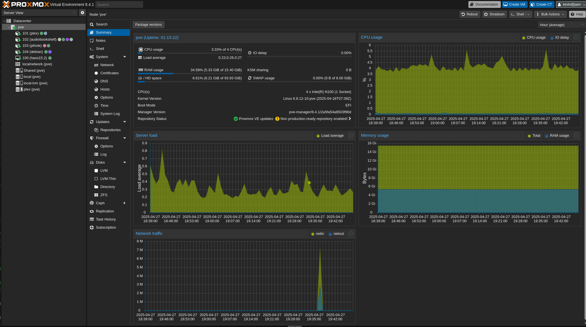

# Building a homelab

In a homelab you can have a starter place where you can learn some things, and if you re-purpose it later, it makes a good media center or home automaiton computer, or even a light web surfing machine mabe for the kids in the family room

## Hardware
A PC with enough storage for everything you want, VMs, data, containers.  That's not really that much storage space needed for most of us.

### The least expensive [$139](https://www.amazon.com/dp/B0F13Q2SLL?th=1)
I would expect to run one VM, and a couple of containers at once. 
- N150 
- 16GB RAM  
- 256GB onboard storage 

### Mid-range cost [$327](https://www.amazon.com/GMKtec-ryzen-mini-pc-computers/dp/B0CD7Y4C5Y?th=1)
You can easily run multiple VMs and several containers at once.
- Ryzen 7
- 32GB RAM
- 1TB onboard storage
- Room for another SSD to add 1 or even 2 TB more storage

### Platform
[Proxmox Virtual Environment](https://www.proxmox.com/en/products/proxmox-virtual-environment/overview) ,a free hypervisor and containers platform. There is good documentation, that will help you with the installation. 

There is a rich community, someone started creating [Helper Scripts](https://community-scripts.github.io/ProxmoxVE/scripts) These will make it really easy to install many different VMs or containers.

### Guests
- Full VM development environment
  - Fedora Linux
  
  You get a full GUI and the ability to install all kinds of development tools, for free.

- Containers that you might find interesting
  - [Plex](https://www.plex.tv/), A media server, not fully free or open source, but has features like remote access
  - [Jellyfin](https://community-scripts.github.io/ProxmoxVE/scripts?id=jellyfin) is a different media server, but remove access is not so simple
  - [Piehole](https://community-scripts.github.io/ProxmoxVE/scripts?id=pihole) a network level (whole home) ad blocker
  - [MySQL](https://community-scripts.github.io/ProxmoxVE/scripts?id=mysql) A very full featured database
  - [Grafana](https://community-scripts.github.io/ProxmoxVE/scripts?id=grafana) Data visualization

In my seemingly never ending moving of home server things around, it looks like I've gotten what I was looking for.  I wanted to have my home server workloads on the one lowest powered system I have. It's an N100 with 16GB of RAM, a 512GB onboard NVME and a 2TB USB attached SSD.

I have Home Assistant in a VM, and containers running  Plex, audiobookshelf, pihole and a debian container that's not yet in use for anything. The utilization is nice and low.  T
Proxmox does make it easier to set all this up, except for adding that disk and the USB pass through for the Zigbee dongle. 

Here's a look at the utilization as of now.

