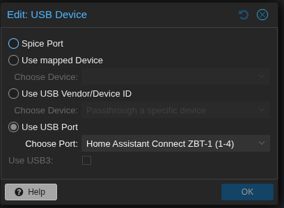

# Red Hat Workshop: Image Mode for Red Hat Enterprise Linux 
## 18-Jun-2025

There is a rotating  workshop, will need to forward to the team.
Image mode works with RHEL 9 and newer

[image mode](https://www.redhat.com/en/blog/image-mode-for-red-hat-enterprise-linux-generally-available)

Store images in any OCI container registry. 

Kickstart lives, it can be how you deploy the images.

[Lab](http://red.ht/im-basics )

A lot like a docker compose, but start with the image, then install additional things.

I asked about installing things that aren't RPMs, we shall see.

You can build your own bootc image, but support will prefer using the standard images.

[bootc catalog](https://catalog.redhat.com/software/containers/rhel10/rhel-bootc/6707d29f27f63a06f7873ee2)

Podman desktop can be used to manage images, to some degree, with an extension.

[Additional link](https://www.redhat.com/en/introduction-to-image-mode-for-red-hat-enterprise-linux-interactive-lab)

bootc switch, how you can go back and forth with versions of things. 

I have a hard time not thinking of Bootsy Collins every time he says bootc :-)

Tagging becomes how you work with images, differentation between versions, dev/test/prod 

Satellite still has a role

This managing config by files, this is a move to gitops for a lot more

WSL should support running these images, so now RHEL as your Linux via WSL

[System roles with image mode](https://developers.redhat.com/articles/2025/03/18/how-use-rhel-system-roles-image-mode)

Fedora 42 supports this same model, the fundamentals at least

*** To roll back you set a flag and reboot, poof, it's rolled back ***

